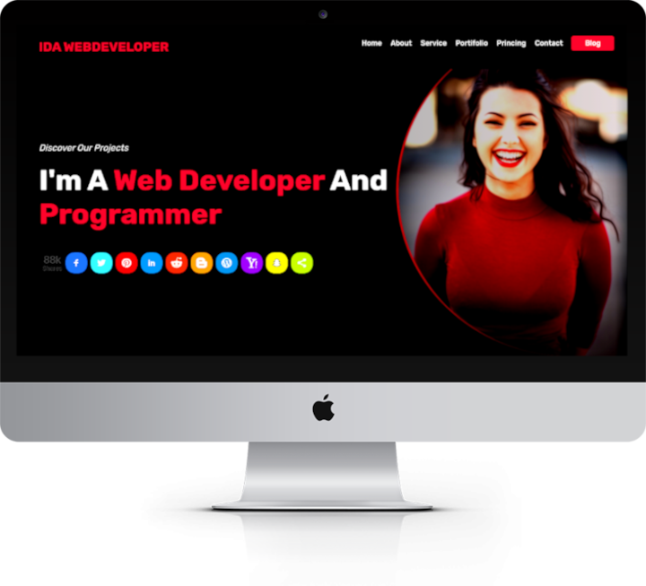

# Ida Portifolio
Para ver o projeto demo, instale os seguintes pacotes.<br>

**Instalação**<br>
- Rubygems
- Jekyll
- bundler

**Download Rubygems**<br>
[https://rubygems.org/](https://rubygems.org/pages/download)

`gem update --system`

`ruby setup.rb --help`

`gem install bundle jekyll`

Após instalação, entre na pasta raiz do projeto e rode os comandos.<br>

**Instalação das e Atualização**<br>

```
bundle install
bundle update
```

**Rodando o Servidor**<br>

```
bundle exec jekyll serve
```

Geralmente, a porta padrão do servidor é **4000**.<br>

**Clique Aqui Após Iniciação Servidor**<br>
[http://localhost:4000](http://localhost:4000)

## Instruções

**_includes**<br>
Pasta que contém os blocos de construção dos layouts<br>

**_layouts**<br>
Pasta que possui estrutura básica do site<br>

**content**<br>
Contém todo o conteúdo do site. Modifique conforme necessário.<br>

**pages**<br>
Parte integrante do layout.<br>

**_data**<br>
Pasta possui arquivos para inserir novas informações nas paginas **portifolio** e **serviços**.<br>

**_config.yml**<br>
Arquivo de configurações básicas do site.<br>

